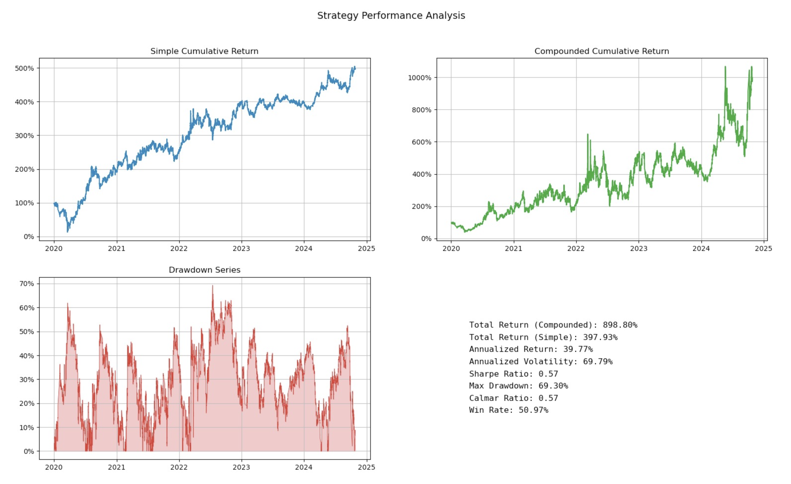
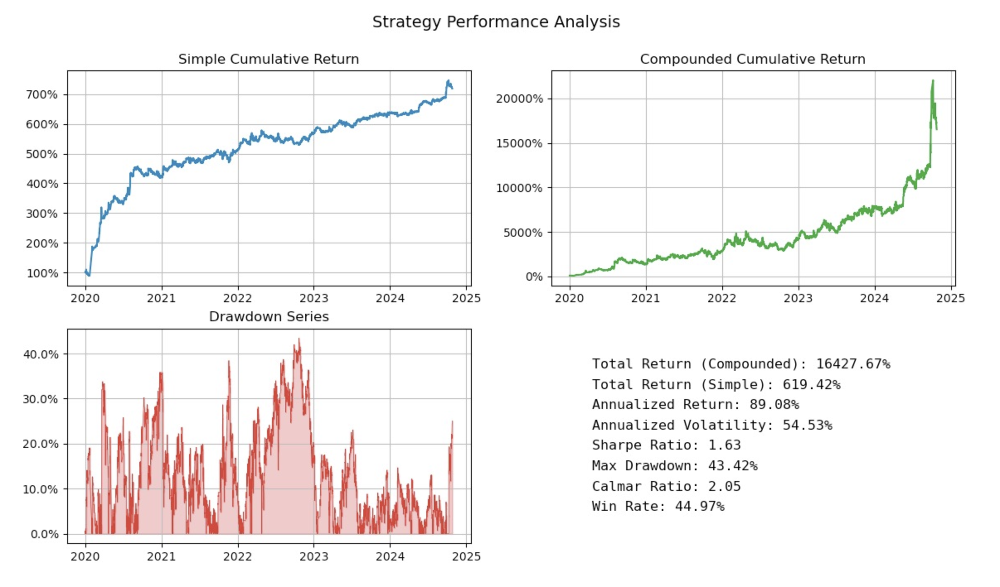
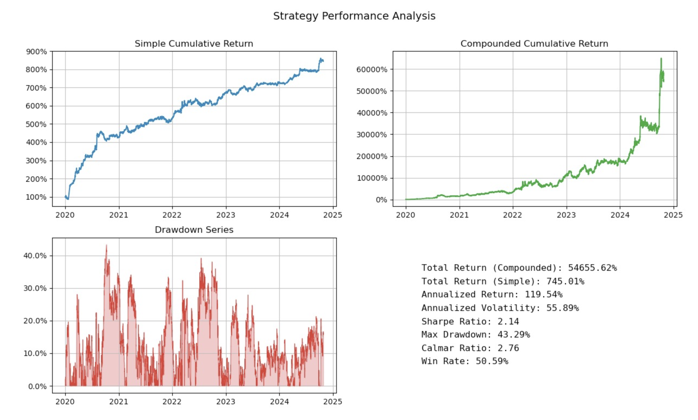

# MFE5210 - Group2 Project

组员：尹美珊、杜金明、王赫男、翁树尧
项目名称：期货全品种多因子/趋势跟踪复合策略与期货算法交易系统

## 代码介绍

- Dependency.py : 策略的数据加载模块、流式计算回测与交易模块

- Plot_Dependency.py : 绘制策略绩效图表模块

- Demo_Factors.py : 因子计算demo文件

- Strategies.py : 策略运行规则文件

- Demo_Run_Mom.py : 趋势跟踪策略demo文件

- Demo_Run_Multi_factor.py : 多因子策略demo文件

- Plot_result.py : 绘制策略组合绩效

- LiveTradingEngine.py : 实盘交易引擎

- PaperTradingEngine.py : 模拟交易引擎

- run_live_trading.py : 实盘交易测试

- run_paper_trading.py : 模拟交易测试

## 组员及任务安排

- 尹美珊：主要负责策略结果整合、PPT编写、以及报告演讲

- 杜金明：主要负责多因子构建与评测、TWAP等相关程序的编写，以及多因子策略开发

- 王赫男：主要负责流式计算回测相关模块、策略绩效图表、策略运行文件的程序编写，以及趋势跟踪策略开发

- 翁树尧：主要负责部分代码优化、策略流程梳理、以及GUI部分的优化

## 策略表现

### 多因子策略

### 趋势跟踪策略

### 组合策略

